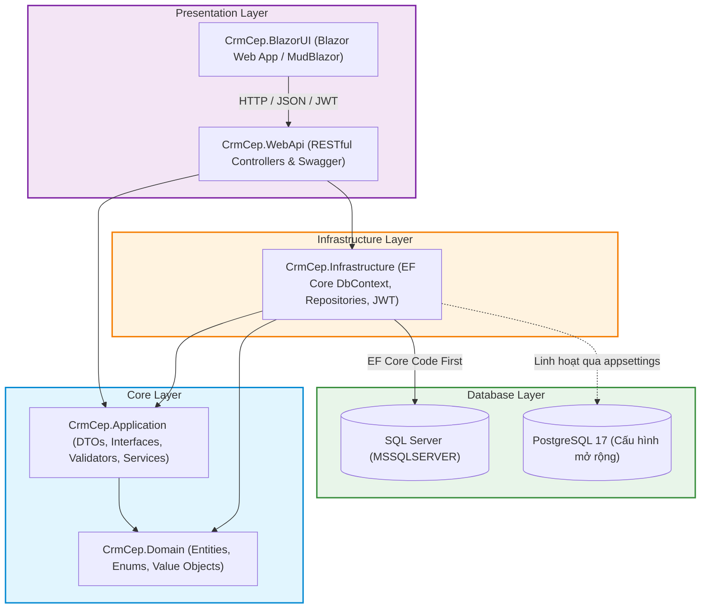
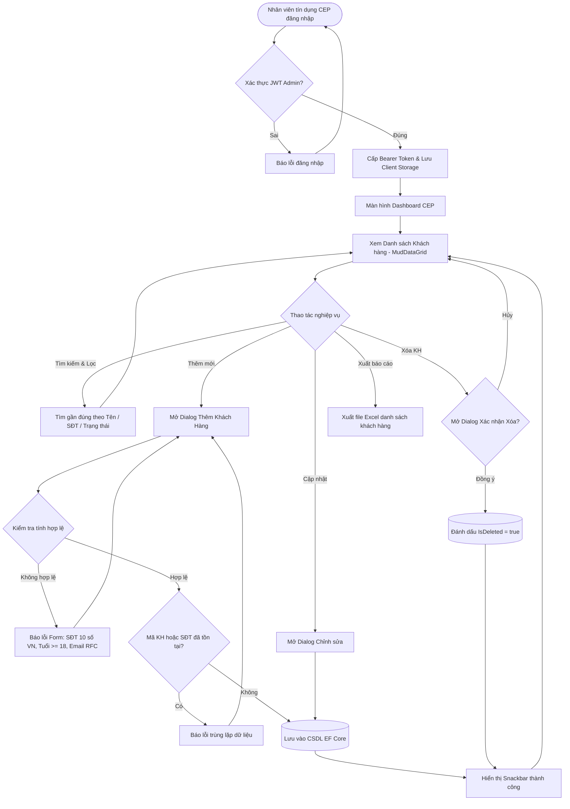

# HỆ THỐNG QUẢN LÝ KHÁCH HÀNG CƠ BẢN (MINI CRM CEP)
### TỔ CHỨC TÀI CHÍNH VI MÔ CEP - PHÒNG CÔNG NGHỆ THÔNG TIN
**Vị trí tuyển dụng:** Chuyên viên Phát triển Phần mềm (.NET/Blazor Developer)  
**Thời gian làm bài:** 15/9/2026 - 18/9/2026 | **Hoàn thành sớm:** 24h00 ngày 17/9/2026  
**Ứng viên:** Đàm Văn Phương  

---

## 1. GIỚI THIỆU DỰ ÁN
Hệ thống **Mini CRM CEP** được xây dựng nhằm phục vụ công tác quản trị dữ liệu khách hàng vay vốn và tiết kiệm vi mô tại Tổ chức Tài chính Vi mô CEP. Dự án đáp ứng 100% tiêu chí đề thi thực hành tuyển dụng, bao gồm đầy đủ các tính năng cốt lõi (CRUD, Tìm kiếm, Lọc, Validation) và các tính năng điểm cộng (Bonus: Xác thực JWT, Thư viện UI hiện đại MudBlazor, Chuẩn mực Git).

---

## 2. MÔI TRƯỜNG & CÔNG CỤ CÀI ĐẶT

| Công cụ / Nền tảng | Phiên bản khuyến nghị | Ghi chú cấu hình |
| :--- | :--- | :--- |
| **.NET SDK** | **.NET 8.0 LTS** (hoặc .NET 9.0) | Đã kiểm tra tương thích trên Windows x64. |
| **Database Engine** | **SQL Server** (MSSQLSERVER 2019/2022) hoặc **PostgreSQL 17** | Mặc định sử dụng **SQL Server** theo đề thi. Hỗ trợ chuyển đổi sang PostgreSQL 17 chỉ bằng 1 dòng cấu hình. |
| **EF Core Tools** | **dotnet-ef 8.x / 10.x** | Cài đặt toàn cục qua lệnh: `dotnet tool install --global dotnet-ef` |
| **UI Library** | **MudBlazor v7.15+** | Thư viện Material Design hàng đầu cho Blazor Web Components. |
| **Thư viện Hỗ trợ** | • `BCrypt.Net-Next 4.0.3`<br>• `System.IdentityModel.Tokens.Jwt 8.0.2`<br>• `FluentValidation 11.9.2`<br>• `Blazored.LocalStorage 4.5.0` | Bảo mật mật khẩu, JWT Auth, kiểm tra hợp lệ dữ liệu và lưu trữ phiên đăng nhập. |
| **IDE Khuyến nghị** | Visual Studio 2022 (v17.8+) hoặc Visual Studio Code (C# Dev Kit) | Hỗ trợ gỡ lỗi và quản lý đa dự án. |
| **Kiểm thử API** | Postman / Thunder Client | Kèm file xuất Postman Collection `docs/CrmCep_Postman_Collection.json`. |

---

## 3. SƠ ĐỒ KIẾN TRÚC HỆ THỐNG (CLEAN ARCHITECTURE)

Dự án áp dụng mô hình **Clean Architecture (Onion Architecture)** phân tách 4 tầng rõ ràng, độc lập và tuân thủ các nguyên tắc thiết kế hướng đối tượng (OOP) và SOLID:



### Cấu trúc Thư mục Chi tiết:
- `src/Core/CrmCep.Domain`: Chứa các thực thể trung tâm (`Customer`, `User`), Enums (`CustomerStatus`, `CustomerSegment`) và lớp cơ sở `BaseEntity`.
- `src/Core/CrmCep.Application`: Chứa DTOs, Interface dịch vụ, quy tắc kiểm tra dữ liệu (`FluentValidation`) và kết quả phản hồi chuẩn (`ApiResponse<T>`, `PaginatedResult<T>`).
- `src/Infrastructure/CrmCep.Infrastructure`: Chứa `ApplicationDbContext`, EF Core Migrations, dịch vụ sinh JWT Bearer Token, mã hóa mật khẩu BCrypt và tự động nạp Seed Data.
- `src/Presentation/CrmCep.WebApi`: Cung cấp các RESTful API endpoints, Swagger UI tích hợp nút Authorize JWT, Middleware bắt lỗi toàn cục và cấu hình CORS.
- `src/Presentation/CrmCep.BlazorUI`: Giao diện Web Blazor tương tác thời gian thực, tích hợp MudBlazor DataGrid, Dialogs và Snackbar Toast.

---

## 4. SƠ ĐỒ LUỒNG NGHIỆP VỤ (CEP CRM BUSINESS FLOW)



---

## 5. DANH MỤC TÍNH NĂNG HỆ THỐNG

### 5.1. Nhóm Tính Năng Cốt Lõi (Bắt Buộc):
1. **Quản lý Khách hàng (CRUD):**
   - Xem danh sách đầy đủ thông tin: Mã KH, Họ tên, Email, SĐT, Ngày sinh, Phân loại, Trạng thái, Ngày tạo.
   - Thêm mới khách hàng với kiểm tra ràng buộc chặt chẽ.
   - Chỉnh sửa thông tin hồ sơ và trạng thái hoạt động.
   - Xóa khách hàng với cơ chế **Soft Delete** (`IsDeleted = true`) bảo toàn dữ liệu tài chính vi mô.
2. **Tìm kiếm & Lọc Nâng cao:**
   - Tìm kiếm tức thời (Realtime) không phân biệt hoa/thường theo **Họ và tên** hoặc **Số điện thoại**.
   - Lọc phân loại theo **Trạng thái** (`Đang hoạt động`, `Tạm ngưng`, `Đã khóa`).
   - Lọc theo **Nhóm đối tượng khách hàng**.
3. **Kiểm tra Hợp lệ (Validation):**
   - Mã KH không được để trống, không được trùng lặp.
   - Số điện thoại bắt buộc, đúng 10 số di động Việt Nam (đầu số 03, 05, 07, 08, 09).
   - Email hợp lệ theo chuẩn RFC quốc tế.
   - Ngày sinh bắt buộc, tuổi từ đủ 18 tuổi trở lên và không quá 100 tuổi.

### 5.2. Nhóm Tính Năng Điểm Cộng (Bonus):
1. **Xác thực JWT (Authentication & Authorization):**
   - Đăng nhập bảo mật cấp JWT Bearer Token có thời hạn.
   - Tài khoản Admin cứng cấu hình sẵn: `admin` / `Admin@123`.
   - Toàn bộ các API nghiệp vụ CRUD đều được bảo vệ bằng `[Authorize]`.
2. **Thư viện UI MudBlazor Component:**
   - Bảng dữ liệu `MudDataGrid` cao cấp hỗ trợ sắp xếp, lọc cột, phân trang linh hoạt.
   - Hộp thoại `MudDialog` nhập liệu mượt mà, thông báo xác nhận xóa an toàn.
   - `MudSnackbar` hiển thị Toast trạng thái tức thì.
3. **Quản lý Git Chuyên nghiệp:**
   - Nhánh phát triển `dev`, nhánh chính `main`.
   - Commit history chi tiết tuân thủ quy chuẩn Conventional Commits (`feat:`, `fix:`, `docs:`, `style:`, `refactor:`).

### 5.3. Nhóm Tính Năng Giá Trị Gia Tăng (Tối Ưu cho CEP):
1. **Dashboard KPI Overview:** 4 Thẻ số liệu thống kê: Tổng số khách hàng, Đang hoạt động, Tạm ngưng, Khách hàng mới trong tháng.
2. **Phân loại Khách hàng CEP (Customer Segment):** Phân chia nhóm đối tượng vay vốn: *Công nhân lao động*, *Tiểu thương buôn bán nhỏ*, *Lao động nghèo tự do*.
3. **Xuất Báo Cáo Excel (Export to Excel):** Hỗ trợ xuất dữ liệu ra file `.xlsx` phục vụ đối soát định kỳ.

---

## 6. HƯỚNG DẪN CÀI ĐẶT & KHỞI CHẠY (QUICK START)

### Bước 1: Cấu hình Chuỗi Kết Nối Database (SQL Server)
Mở file `src/Presentation/CrmCep.WebApi/appsettings.json` để lựa chọn phương thức xác thực SQL Server:

```json
{
  "ConnectionStrings": {
    // Lựa chọn 1 (Mặc định): Xác thực Windows Authentication (Không cần User/Pass)
    "DefaultConnection": "Server=localhost;Database=CrmCepDb;Trusted_Connection=True;TrustServerCertificate=True;MultipleActiveResultSets=true;",
    
    // Lựa chọn 2: Xác thực tài khoản SQL Server với User ID và Password
    "SqlAuthConnection": "Server=localhost;Database=CrmCepDb;User Id=sa;Password=YourStrongPassword123!;TrustServerCertificate=True;MultipleActiveResultSets=true;"
  }
}
```
> **Ghi chú:**  
> - Nếu SQL Server trên máy bạn bật chế độ **Windows Authentication** (mặc định), hệ thống tự động đăng nhập an toàn mà không cần nhập mật khẩu.  
> - Nếu bạn muốn dùng tài khoản SQL cụ thể (như `sa`), chỉ cần đổi `DefaultConnection` sang định dạng `User Id=...;Password=...`.

---

### Bước 2: Tự Động Chạy Migration & Khởi Tạo Dữ Liệu (Auto-Migration)
⚡ **Đặc biệt:** Ứng dụng đã được tích hợp sẵn cơ chế **Auto-Migration & Seed Data** tại `Program.cs`. Khi bạn khởi chạy Web API bằng lệnh `dotnet run`:
1. Hệ thống sẽ **tự động chạy Migration** (`context.Database.MigrateAsync()`) để tạo CSDL `CrmCepDb` và các bảng `Customers`, `Users`.
2. Tự động khởi tạo tài khoản quản trị mặc định: `admin` / `Admin@123`.
3. Tự động nạp sẵn 5 bản ghi khách hàng vi mô mẫu (Công nhân, Tiểu thương, Lao động tự do) để bạn kiểm thử ngay lập tức.

*(Tùy chọn: Nếu muốn chạy migration thủ công trước từ CLI, bạn có thể gõ: `dotnet ef database update --project src/Infrastructure/CrmCep.Infrastructure --startup-project src/Presentation/CrmCep.WebApi`)*.

---

### Bước 3: Khởi Chạy Backend Web API
```bash
cd src/Presentation/CrmCep.WebApi
dotnet run
```
- Swagger UI kiểm thử trực tiếp: `https://localhost:7083/swagger` (hoặc cổng HTTP hiển thị trên màn hình terminal).

---

### Bước 4: Khởi Chạy Frontend Blazor UI
Mở một cửa sổ Terminal mới:
```bash
cd src/Presentation/CrmCep.BlazorUI
dotnet run
```
- Giao diện người dùng: Mở trình duyệt truy cập đường dẫn xuất hiện trên console (ví dụ: `https://localhost:7198`).

### Bước 5: Đăng Nhập Hệ Thống
- **Tên đăng nhập:** `admin`
- **Mật khẩu:** `Admin@123`

---

## 7. DANH MỤC API ENDPOINTS (RESTFUL SPECIFICATION)

| Phương thức | Endpoint | Yêu cầu Auth | Mô tả Chức năng | Payload mẫu |
| :---: | :--- | :---: | :--- | :--- |
| **POST** | `/api/auth/login` | Không | Đăng nhập tài khoản, cấp JWT Bearer Token | `{"username": "admin", "password": "Admin@123"}` |
| **GET** | `/api/customers` | Có (Bearer) | Lấy danh sách khách hàng phân trang, tìm kiếm theo Tên/SĐT, lọc trạng thái | Query: `?keyword=Nguyen&status=1&pageIndex=1&pageSize=10` |
| **GET** | `/api/customers/{id}` | Có (Bearer) | Lấy thông tin chi tiết một khách hàng theo Id | N/A |
| **POST** | `/api/customers` | Có (Bearer) | Thêm mới một khách hàng | `{"customerCode": "KH-2026-0006", "fullName": "Lê Văn An", "phoneNumber": "0901234567", "email": "an.le@gmail.com", "dateOfBirth": "1998-05-10", "segment": 1, "status": 1}` |
| **PUT** | `/api/customers/{id}` | Có (Bearer) | Cập nhật thông tin khách hàng | `{"fullName": "Lê Văn An", "phoneNumber": "0901234567", "email": "an.le@gmail.com", "dateOfBirth": "1998-05-10", "segment": 1, "status": 1}` |
| **DELETE** | `/api/customers/{id}` | Có (Bearer) | Xóa mềm khách hàng (`IsDeleted = true`) | N/A |
| **GET** | `/api/customers/dashboard-stats` | Có (Bearer) | Lấy số liệu thống kê KPI tổng quan cho Dashboard | N/A |
| **GET** | `/api/customers/export-excel` | Có (Bearer) | Xuất danh sách khách hàng ra file Excel (.xlsx) | Query: `?keyword=&status=` |

---

## 8. TIÊU CHUẨN CODE & ĐÁNH GIÁ CHẤT LƯỢNG
- **Code sạch & SOLID:** Chia tách Interface và Implementation rõ ràng, không phụ thuộc vòng.
- **Concise English Comments:** Toàn bộ ghi chú code, docstrings đều được viết bằng tiếng Anh ngắn gọn, súc tích theo chuẩn quốc tế.
- **Zero Warnings:** Đảm bảo toàn bộ Solution biên dịch hoàn hảo không có cảnh báo nào.
- **Tài liệu bàn giao kèm theo:**
  - `docs/TaiLieuPhanTich_KeHoach_PhanA.pdf`: Báo cáo Phân tích, Database & Estimation nộp hội đồng tuyển dụng.
  - `docs/CrmCep_Postman_Collection.json`: Bộ kịch bản kiểm thử API xuất từ Postman.